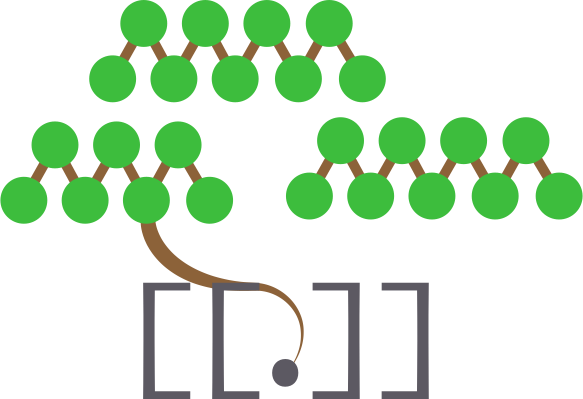

# WikiBonsai

> A knowledge bonsai wends through concepts in semantic space, like a melody winds through harmonies in music.

###### [cite me!][wibomd-doc-cite-this]

  

> ⚠️ Please remember to backup all data and use version control.

The WikiBonsai project[^ai] transforms a collection of markdown files into a text-based, easy-to-navigate [jungle gym for thought][wibomd-doc-philosophy--a-jungle-gym-for-thought][^mind] with an [API for the mind][wibomd-doc-design--an-api-for-the-mind][^mixed-metaphors]. This is accomplished by enabling personal knowledge management (PKM) workflows that rely on `[[wiki]]` syntaxes, "semantic trees" or "knowledge bonsais", and data visualizations that are viewable on screens or in augmented/virtual reality.

This project is about strategically implementing and open-sourcing functionality that will benefit the most users and developers across the digital ecosystem. Thus, it abides by the [Unix Philosophy][art-unix-phil]: Everything is modularized and implemented in such a way as to maximize re-use whether it be for the browser, desktop, mobile, or headset. It's about furthering the state of PKM as a whole by building atop "[standardization bedrock][wibomd-doc-design--drilling-down-to-standardization-bedrock]" instead of just creating a single application.

Further, these workflows may also facilitate the mapping of [semantic space][wibomd-doc-design--semantic-space] which could prove an invaluable resource in building a better understanding of how neural nets work and furthering the development of interpretable, explainable AI.

Only time will tell how far this path may [go][wibomd-doc-philosophy--finding-free-will].

## Notable Workflows

These are the workflows the WikiBonsai project enables for markdown-based collections of notes:

1. Expanded [`[[wikirefs]]`][wibomd-repo-wikirefs] syntax for quick associative linking (a.k.a. "wikilink", "bidirectional link", "[internal link][mediawiki-internal-link]", etc.).
2. [Mechanics][wibomd-repo-semtree] to cultivate and train a unified "[semantic tree][reddit-musk]" or "knowledge bonsai" across a collection of markdown files.
3. [Graph][wibomd-repo-treehouze] utilities to experience and interact with a unified visual-spatial "[memory palace][memory-palace]" that emerges from the relationships formed across markdown notes (syntaxes 1 + 1).
4. A clean, lean, [yaml][yaml]-like [markup language for structured attributes][wibomd-repo-caml-mkdn] (with built-in `[[wikiref]]` support).

These workflows are what distinguish the "WikiBonsai" from other styles of digital garden -- particularly the [semantic tree][reddit-musk].

## Project Info

### Docs

The documentation in this repository describe the philosophies, mechanics, and terminologies that are adopted throughout all of the WikiBonsai projects:

- For Use:
  - [Getting Started][wibomd-doc-use]
  - [Privacy and Security][wibomd-doc-secure]
- For Dev:
  - [Design Principles][wibomd-doc-design]
  - [Terminology][wibomd-doc-terms]
  - [Code of Conduct][wibomd-doc-code-of-conduct]
  - [Contributing][wibomd-doc-contributing]
- For Lore:
  - [Guiding Philosophy][wibomd-doc-philosophy]
  - [Origin Story][wibomd-doc-story]
  - [Citations and Sources][wibomd-doc-cite]
- For Input:
  - [Questions][wibomd-doc-questions]

### Repos

The following links point to repositories of the WikiBonsai project and are organized by stack depth. Projects toward the top are ready-to-use and meant for the end user, while projects toward the bottom are meant for developers to build with and integrate into other solutions:

- For Use:
  - AI:
    - [semtree-germ][wibomd-repo-semtree-germ]: An AI-powered "[Semantic Tree Germinator][demo-semtree-germ]" to generate starter semantic trees to transplant into one's own digital garden.
    - [prompt][wibomd-repo-promp]: Prompts for AI-powered digital gardening.
  - Notes:
    - [vscode-wikibonsai][wibomd-repo-vscode-wikibonsai]: A [VSCode][git-vscode] extension for tending a WikiBonsai digital garden.
    - [tendr-cli][wibomd-repo-tendr-cli]: A CLI tool for tending a markdown-based WikiBonsai digital garden.
  - SSG:
    - [jekyll-wikibonsai][wibomd-repo-jekyll-wikibonsai]: A jekyll template that can be imported as a gem or cloned as a template project.
    - [astro-wikibonsai][wibomd-repo-astro-wikibonsai]: An example setup to enable WikiBonsai workflows for an astro-based statically generated site (SSG).
    - [eleventy-wikibonsai][wibomd-repo-eleventy-wikibonsai]: An example setup to enable WikiBonsai workflows for eleventy-based static site generation (SSG).
  - Starters:
    - [garden-beds][wibomd-repo-garden-beds]: A collection of starter WikiBonsai digital gardens.
    - [germs][wibomd-repo-germs]: A collection of markdown files meant to be added to pre-existing WikiBonsai, or other style, digital gardens.
- For Dev
  - Markdown Parsers:
    - [markdown-it-caml][wibomd-repo-markdown-it-caml]: A [markdown-it][git-markdown-it] plugin to enable  `:colon::attributes`.
    - [markdown-it-wikirefs][wibomd-repo-markdown-it-wikirefs]: A [markdown-it][git-markdown-it] plugin to enable `[[wikirefs]]`.
    - [remark-caml][wibomd-repo-remark-caml]: A [remark][git-remark] plugin to enable `:colon::attributes`.
    - [remark-wikirefs][wibomd-repo-remark-wikirefs]: A [remark][git-remark] plugin to enable `[[wikirefs]]`.
  - Jekyll:
    - [jekyll-graph][wibomd-repo-jekyll-graph]: A jekyll plugin to generate graphs of blog content.
    - [jekyll-semtree][wibomd-repo-jekyll-semtree]: A jekyll plugin to generate a semantic tree from index collections.
    - [jekyl-wikirefs][wibomd-repo-jekyll-wikirefs]: A jekyll plugin to enable `[[wikirefs]]`.
  - Base:
    - [caml][wibomd-repo-caml-mkdn]: Base utilities for Colon Attribute Markup Language (`:colon::attributes`).
    - [caudex][wibomd-repo-caudex]: An index to cache and store WikiBonsai relationships.
    - [semtree][wibomd-repo-semtree]: Base utilities for "semantic tree" or "knowledge bonsai" building in markdown.
    - [treehouze][wibomd-repo-treehouze]: Generalized graph utilities with minor specialized features for visualizing WikiBonsai-enabled markdown-based PKMs.
    - [wikirefs][wibomd-repo-wikirefs]: Base utilities for `[[wikirefs]]`.
  - Spec:
    - [caml-spec][wibomd-repo-caml-spec]: Test suite for Colon Attribute Markup Language (`:colon::attributes`) specification.
    - [wikirefs-spec][wibomd-repo-wikirefs-spec]: Test suite for `[[wikirefs]]` specification.

## ⚠️ Usage Note

The systems you interact with have an effect on the way you think. This system is meant to provide a ["jungle gym for the thought,"][wibomd-doc-philosophy--a-jungle-gym-for-thought] but it can't do everything and might even have negative consequences if used improperly. Here are some supplemental suggestions for adopting a framework such as this, especially for educational purposes:

### Write Full Essays

The workflows this project enables are meant to help develop an explicit relationship with the words you use. It's possible over-reliance on a tool like this (like many other digital productivity tools) can allow, or even facilitate, overly modular and fractured trains of thought. Writing [full essays][utb-essay] can combat fractured thinking and exercise those parts of the mind.

### Refer to Common Cultural Reference Points
###### (such as [britannica][britannica] or [wikipedia][wikipedia])

By adopting a tool specifically meant for mapping vocabulary, it can be tempting to use niche words or make up one's own to demarcate an idea. But too much of this risks building a Tower of Babel and losing the ability to communicate effectively with others. Use shared vocabulary where you can and if you've found a word of better fit, use it with others. That is the purpose of language after all.

### There is Never a "Final Word"

Like this project it is best to view a set of notes and explicit knowledge as a current state of affairs -- it's the state of the trail; of how much clutter has been cleared away. The goal is to build a navigable path for yourself, but to remain aware of what other things lie beyond the already-explored path. Always be open to what hard reality is telling you, especially while getting your hands dirty.

### Get Your Hands Dirty

The digital world cannot replace practical, hands-in-the-mud experience. No matter what you learn or study be sure to learn something, _anything_, that requires your hands in the real world.

## Forward

As with pretty much all human endeavors, this project does not represent any kind of "final word" or "best solution" but a "clearing of brush" or "cutting away the chaffe"...Of making the road ahead a touch less bumpy and a bit more wonder-full for those that follow.

[**just keep tending...🪴**][wibomd-doc-use]

[^ai]: 🤖 AI Collaboration: To date, code and prose of the WikiBonsai project was not written by AI, but was _occasionally_ consulted to improve overall quality. This may or may not change going forward.
[^mind]: Not too dissimilar from a ["bicycle for the mind"][utb-mind-bike].
[^mixed-metaphors]: Please excuse the mixed metaphor soup.

[art-unix-phil]: <https://ia902701.us.archive.org/12/items/bstj57-6-1899/bstj57-6-1899_text.pdf>
[britannica]: <https://britannica.com/>
[demo-semtree-germ]: <https://semantic-tree.netlify.app>
[reddit-musk]: <https://www.reddit.com/r/IAmA/comments/2rgsan/comment/cnfput4/>
[git-markdown-it]: <https://github.com/markdown-it/markdown-it>
[git-remark]: <https://github.com/remarkjs/remark>
[git-vscode]: <https://github.com/microsoft/vscode>
[mediawiki-internal-link]: <https://www.mediawiki.org/wiki/Help:Links#Internal_links>
[memory-palace]: <https://artofmemory.com/blog/how-to-build-a-memory-palace/>
[utb-essay]: <https://www.youtube.com/watch?v=XHIhtWPpDVI>
[utb-mind-bike]: <https://www.youtube.com/watch?v=KmuP8gsgWb8>
[wikipedia]: <https://www.wikipedia.org>
[yaml]: <https://yaml.org/>

[wibomd-doc-cite]: <https://github.com/wikibonsai/wikibonsai/tree/main/docs/CITE.md>
[wibomd-doc-cite-this]: <https://github.com/wikibonsai/wikibonsai/tree/main/CITATION.bib>
[wibomd-doc-code-of-conduct]: <https://github.com/wikibonsai/wikibonsai/tree/main/docs/CODE_OF_CONDUCT.md>
[wibomd-doc-contributing]: <https://github.com/wikibonsai/wikibonsai/tree/main/CONTRIBUTING.md>
[wibomd-doc-design]: <https://github.com/wikibonsai/wikibonsai/tree/main/docs/DESIGN.md>
[wibomd-doc-design--an-api-for-the-mind]: <https://github.com/wikibonsai/wikibonsai/tree/main/docs/DESIGN.md#an-api-for-the-mind>
[wibomd-doc-design--drilling-down-to-standardization-bedrock]: <https://github.com/wikibonsai/wikibonsai/tree/main/docs/DESIGN.md#drilling-down-to-standardization-bedrock>
[wibomd-doc-design--semantic-space]: <https://github.com/wikibonsai/wikibonsai/tree/main/docs/DESIGN.md#semantic-space8>
[wibomd-doc-philosophy]: <https://github.com/wikibonsai/wikibonsai/tree/main/docs/PHILOSOPHY.md>
[wibomd-doc-philosophy--a-jungle-gym-for-thought]: <https://github.com/wikibonsai/wikibonsai/tree/main/docs/PHILOSOPHY.md#a-jungle-gym-for-thought>
[wibomd-doc-philosophy--finding-free-will]: <https://github.com/wikibonsai/wikibonsai/tree/main/docs/PHILOSOPHY.md#finding-free-will>
[wibomd-doc-questions]: <https://github.com/wikibonsai/wikibonsai/tree/main/docs/Q.md>
[wibomd-doc-secure]: <https://github.com/wikibonsai/wikibonsai/tree/main/docs/SECURE.md>
[wibomd-doc-story]: <https://github.com/wikibonsai/wikibonsai/tree/main/docs/STORY.md>
[wibomd-doc-terms]: <https://github.com/wikibonsai/wikibonsai/tree/main/docs/TERMS.md>
[wibomd-doc-use]: <https://github.com/wikibonsai/wikibonsai/tree/main/docs/USE.md>

[wibomd-repo-astro-wikibonsai]: <https://github.com/wikibonsai/astro-wikibonsai>
[wibomd-repo-caml-mkdn]: <https://github.com/wikibonsai/caml-mkdn>
[wibomd-repo-caml-spec]: <https://github.com/wikibonsai/caml-mkdn/tree/main/spec>
[wibomd-repo-caudex]: <https://github.com/wikibonsai/caudex>
[wibomd-repo-eleventy-wikibonsai]: <https://github.com/wikibonsai/eleventy-wikibonsai>
[wibomd-repo-garden-beds]: <https://github.com/wikibonsai/garden-beds>
[wibomd-repo-germs]: <https://github.com/wikibonsai/germs>
[wibomd-repo-jekyll-graph]: <https://github.com/wikibonsai/jekyll-graph>
[wibomd-repo-jekyll-semtree]: <https://github.com/wikibonsai/jekyll-semtree>
[wibomd-repo-jekyll-wikibonsai]: <https://github.com/wikibonsai/jekyll-wikibonsai>
[wibomd-repo-jekyll-wikirefs]: <https://github.com/wikibonsai/jekyll-wikirefs>
[wibomd-repo-markdown-it-caml]: <https://github.com/wikibonsai/markdown-it-caml>
[wibomd-repo-markdown-it-wikirefs]: <https://github.com/wikibonsai/markdown-it-wikirefs>
[wibomd-repo-promp]: <https://github.com/wikibonsai/prompt>
[wibomd-repo-remark-caml]: <https://github.com/wikibonsai/remark-caml>
[wibomd-repo-remark-wikirefs]: <https://github.com/wikibonsai/remark-wikirefs>
[wibomd-repo-semtree]: <https://github.com/wikibonsai/semtree>
[wibomd-repo-semtree-germ]: <https://github.com/wikibonsai/semtree-germ>
[wibomd-repo-tendr-cli]: <https://github.com/wikibonsai/tendr-cli>
[wibomd-repo-treehouze]: <https://github.com/wikibonsai/treehouze>
[wibomd-repo-vscode-wikibonsai]: <https://github.com/wikibonsai/vscode-wikibonsai>
[wibomd-repo-wikirefs]: <https://github.com/wikibonsai/wikirefs>
[wibomd-repo-wikirefs-spec]: <https://github.com/wikibonsai/wikirefs/tree/main/spec>

  🇺🇸 Made in the USA 🦅 🐊

