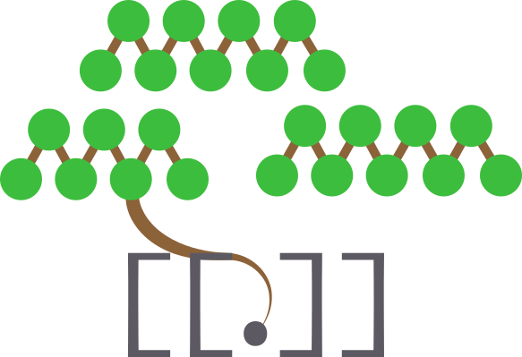

# WikiBonsai

> A knowledge bonsai wends through concepts in semantic space, like a melody winds through harmonies in music.

###### [cite me!][wibomd-doc-cite-this]

  

> ⚠️ Please remember to backup all data and use version control.

WikiBonsai extends markdown with `[[wiki]]` syntaxes, semantic trees, structured attributes, and graph visualizations. These mechanics build a structured knowledge layer in plain text. The same conventions that help people organize what they know also give AI agents a way to read, write, and reason over that knowledge.

Plain text is our common ground.

## Quick Start

You can get started immediately with the [vscode extension][wibomd-vscode-tendr], the [CLI tool][wibomd-tendr-cli], or the [agent skill][wibomd-repo-tendr-skill].

For more details, check out the full [guide][wibomd-doc-use] on getting started.

## How It Works

1. **[`[[Wikirefs]]`][wibomd-repo-wikirefs]** -- Link concepts with wiki-style syntax for quick associative linking (a.k.a. "wikilink", "bidirectional link", "[internal link][mediawiki-internal-link]", etc.).
2. **[Semantic Trees][wibomd-repo-semtree]** -- Organize concepts into a unified "[knowledge bonsai][reddit-musk]" that spans your collection of markdown files.
3. **[Structured Attributes][wibomd-repo-caml-mkdn]** -- Add clean, [yaml][yaml]-like `:colon::attributes` metadata (with built-in `[[wikiref]]` support).
4. **[Graph View][wibomd-repo-treehouze]** -- See and interact with the "[memory palace][memory-palace]" that emerges from relationships across your notes.

These workflows define the "WikiBonsai" philosophy of knowledge architecture and may also facilitate the mapping of [semantic space][wibomd-doc-design--semantic-space]. This mapping may prove invaluable in building a better understanding of how neural nets work and furthering the development of interpretable, explainable AI.

## Project Info

### Docs

The documentation in this repository describes the philosophies, mechanics, and terminologies that are adopted throughout all of the WikiBonsai projects:

- For Use:
  - [Getting Started][wibomd-doc-use]
  - [Privacy and Security][wibomd-doc-secure]
- For Dev:
  - [Design Principles][wibomd-doc-design]
  - [Terminology][wibomd-doc-terms]
  - [Code of Conduct][wibomd-doc-code-of-conduct]
  - [Contributing][wibomd-doc-contributing]
- For Lore:
  - [Guiding Philosophy][wibomd-doc-philosophy]
  - [Origin Story][wibomd-doc-story]
  - [Citations and Sources][wibomd-doc-cite]
- For Input:
  - [Questions][wibomd-doc-questions]

And be sure to check out [other][social-substack] [writings][social-x] for art, writing, memes, and more.

### Repos

This project abides by the [Unix Philosophy][art-unix-phil]. Everything is modularized and implemented in such a way as to maximize re-use whether it be for the browser, desktop, mobile, or headset. It's about furthering structured knowledge tooling by building atop "[standardization bedrock][wibomd-doc-design--drilling-down-to-standardization-bedrock]" instead of just creating a single application.

The following links point to repositories of the WikiBonsai project and are organized by stack depth. Projects toward the top are ready-to-use and meant for the end user, while projects toward the bottom are meant for developers to build with and integrate into other solutions.

Repo list

- For Use:
  - AI:
    - [germinator][wibomd-repo-germinator]: An AI-powered semantic seedling [germinator][demo-germinator] that generates starter semantic mappings of concepts which are easily transplantable into one's own digital garden.
      - [semtree-germ][wibomd-repo-semtree-germ]: An earlier version of the germinator that focused on [semantic trees][demo-semtree-germ].
    - [tree-trainer][wibomd-repo-tree-trainer]: An AI-powered [tree trainer][demo-tree-trainer] that generates syntax trees for sentence(s).
    - [tendr-skill][wibomd-repo-tendr-skill]: A skill for AI agents to tend their knowledge base.
  - Notes:
    - [vscode-tendr][wibomd-repo-vscode-tendr]: A [VSCode][git-vscode] extension for tending a WikiBonsai digital garden.
    - [tendr-cli][wibomd-repo-tendr-cli]: A CLI tool for tending a markdown-based WikiBonsai digital garden.
    - [transplant-starters][wibomd-repo-transplant-starters]: A collection of starter WikiBonsai digital gardens -- includes starter markdown files and config files.
  - SSG:
    - [jekyll-garden][wibomd-repo-jekyll-garden]: A [jekyll][ssg-jekyll] template that can be imported as a gem or cloned as a template project.
    - [jekyll-bloomz][wibomd-repo-jekyll-bloomz]: An example setup to enable WikiBonsai workflows for a [jekyll][ssg-jekyll]-based statically generated site (SSG).
    - [astro-bloomz][wibomd-repo-astro-bloomz]: An example setup to enable WikiBonsai workflows for an [astro][ssg-astro]-based statically generated site (SSG).
    - [eleventy-bloomz][wibomd-repo-eleventy-bloomz]: An example setup to enable WikiBonsai workflows for [eleventy][ssg-eleventy]-based static site generation (SSG).
- For Dev:
  - Markdown Parsers:
    - [markdown-it-caml][wibomd-repo-markdown-it-caml]: A [markdown-it][git-markdown-it] plugin to enable `:colon::attributes`.
    - [markdown-it-wikirefs][wibomd-repo-markdown-it-wikirefs]: A [markdown-it][git-markdown-it] plugin to enable `[[wikirefs]]`.
    - [remark-caml][wibomd-repo-remark-caml]: A [remark][git-remark] plugin to enable `:colon::attributes`.
    - [remark-wikirefs][wibomd-repo-remark-wikirefs]: A [remark][git-remark] plugin to enable `[[wikirefs]]`.
  - Jekyll:
    - [jekyll-graph][wibomd-repo-jekyll-graph]: A jekyll plugin to generate graphs of blog content.
    - [jekyll-semtree][wibomd-repo-jekyll-semtree]: A jekyll plugin to generate a semantic tree from index collections.
    - [jekyll-wikirefs][wibomd-repo-jekyll-wikirefs]: A jekyll plugin to enable `[[wikirefs]]`.
  - Base:
    - [almanac][wibomd-repo-almanac]: A type system for markdown-based knowledge.
    - [caml][wibomd-repo-caml-mkdn]: Base utilities for Colon Attribute Markup Language (`:colon::attributes`).
    - [caudex][wibomd-repo-caudex]: An index to cache and store WikiBonsai relationships.
    - [semtree][wibomd-repo-semtree]: Base utilities for "semantic tree" or "knowledge bonsai" building in markdown.
    - [treehouze][wibomd-repo-treehouze]: Generalized graph utilities with minor specialized features for visualizing WikiBonsai-enabled markdown-based knowledge collections.
    - [trug][wibomd-repo-trug]: A config handler for WikiBonsai-style knowledge collections.
    - [wikirefs][wibomd-repo-wikirefs]: Base utilities for internal links (`[[wikirefs]]`).
  - Spec:
    - [caml-spec][wibomd-repo-caml-spec]: Test suite for Colon Attribute Markup Language, CAML, (`:colon::attributes`) specification.
    - [wikirefs-spec][wibomd-repo-wikirefs-spec]: Test suite for wikirefs (`[[wikirefs]]`) specification.

## Foreword

Here's to making the road ahead a bit smoother for those that follow.

[**just keep tending...🪴**][wibomd-doc-use]

[art-unix-phil]: <https://ia902701.us.archive.org/12/items/bstj57-6-1899/bstj57-6-1899_text.pdf>
[demo-germinator]: <https://germ-inator.netlify.app>
[demo-semtree-germ]: <https://semantic-tree.netlify.app>
[demo-tree-trainer]: <https://tree-trainer.netlify.app>
[reddit-musk]: <https://www.reddit.com/r/IAmA/comments/2rgsan/comment/cnfput4/>
[git-markdown-it]: <https://github.com/markdown-it/markdown-it>
[git-remark]: <https://github.com/remarkjs/remark>
[git-vscode]: <https://github.com/microsoft/vscode>
[mediawiki-internal-link]: <https://www.mediawiki.org/wiki/Help:Links#Internal_links>
[memory-palace]: <https://artofmemory.com/blog/how-to-build-a-memory-palace/>
[ssg-astro]: <https://github.com/withastro/astro>
[ssg-jekyll]: <https://github.com/jekyll/jekyll>
[ssg-eleventy]: <https://github.com/11ty/eleventy/>
[yaml]: <https://yaml.org/>

[social-substack]: <https://wibomd.substack.com>
[social-x]: <https://x.com/wibomd>

[wibomd-doc-cite]: <https://github.com/wikibonsai/wikibonsai/tree/main/docs/CITE.md>
[wibomd-doc-cite-this]: <https://github.com/wikibonsai/wikibonsai/tree/main/CITATION.bib>
[wibomd-doc-code-of-conduct]: <https://github.com/wikibonsai/wikibonsai/tree/main/docs/CODE_OF_CONDUCT.md>
[wibomd-doc-contributing]: <https://github.com/wikibonsai/wikibonsai/tree/main/CONTRIBUTING.md>
[wibomd-doc-design]: <https://github.com/wikibonsai/wikibonsai/tree/main/docs/DESIGN.md>
[wibomd-doc-design--drilling-down-to-standardization-bedrock]: <https://github.com/wikibonsai/wikibonsai/tree/main/docs/DESIGN.md#drilling-down-to-standardization-bedrock>
[wibomd-doc-design--semantic-space]: <https://github.com/wikibonsai/wikibonsai/tree/main/docs/DESIGN.md#semantic-space8>
[wibomd-doc-philosophy]: <https://github.com/wikibonsai/wikibonsai/tree/main/docs/PHILOSOPHY.md>
[wibomd-doc-questions]: <https://github.com/wikibonsai/wikibonsai/tree/main/docs/Q.md>
[wibomd-doc-secure]: <https://github.com/wikibonsai/wikibonsai/tree/main/docs/SECURE.md>
[wibomd-doc-story]: <https://github.com/wikibonsai/wikibonsai/tree/main/docs/STORY.md>
[wibomd-doc-terms]: <https://github.com/wikibonsai/wikibonsai/tree/main/docs/TERMS.md>
[wibomd-doc-use]: <https://github.com/wikibonsai/wikibonsai/tree/main/docs/USE.md>

[wibomd-repo-almanac]: <https://github.com/wikibonsai/almanac>
[wibomd-repo-astro-bloomz]: <https://github.com/wikibonsai/astro-bloomz>
[wibomd-repo-caml-mkdn]: <https://github.com/wikibonsai/caml-mkdn>
[wibomd-repo-caml-spec]: <https://github.com/wikibonsai/caml-mkdn/tree/main/spec>
[wibomd-repo-caudex]: <https://github.com/wikibonsai/caudex>
[wibomd-repo-eleventy-bloomz]: <https://github.com/wikibonsai/eleventy-bloomz>
[wibomd-repo-transplant-starters]: <https://github.com/wikibonsai/transplant-starters>
[wibomd-repo-germinator]: <https://github.com/wikibonsai/germinator>
[wibomd-repo-jekyll-bloomz]: <https://github.com/wikibonsai/jekyll-bloomz>
[wibomd-repo-jekyll-graph]: <https://github.com/wikibonsai/jekyll-graph>
[wibomd-repo-jekyll-semtree]: <https://github.com/wikibonsai/jekyll-semtree>
[wibomd-repo-jekyll-garden]: <https://github.com/wikibonsai/jekyll-garden>
[wibomd-repo-jekyll-wikirefs]: <https://github.com/wikibonsai/jekyll-wikirefs>
[wibomd-repo-markdown-it-caml]: <https://github.com/wikibonsai/markdown-it-caml>
[wibomd-repo-markdown-it-wikirefs]: <https://github.com/wikibonsai/markdown-it-wikirefs>
[wibomd-repo-remark-caml]: <https://github.com/wikibonsai/remark-caml>
[wibomd-repo-remark-wikirefs]: <https://github.com/wikibonsai/remark-wikirefs>
[wibomd-repo-semtree]: <https://github.com/wikibonsai/semtree>
[wibomd-repo-semtree-germ]: <https://github.com/wikibonsai/semtree-germ>
[wibomd-repo-tree-trainer]: <https://github.com/wikibonsai/tree-trainer>
[wibomd-repo-trug]: <https://github.com/wikibonsai/trug>
[wibomd-repo-tendr-cli]: <https://github.com/wikibonsai/tendr-cli>
[wibomd-repo-tendr-skill]: <https://github.com/wikibonsai/tendr-skill>
[wibomd-repo-treehouze]: <https://github.com/wikibonsai/treehouze>
[wibomd-repo-vscode-tendr]: <https://github.com/wikibonsai/vscode-tendr>
[wibomd-repo-wikirefs]: <https://github.com/wikibonsai/wikirefs>
[wibomd-repo-wikirefs-spec]: <https://github.com/wikibonsai/wikirefs/tree/main/spec>

[wibomd-tendr-cli]: <https://npmjs.org/tendr-cli>
[wibomd-vscode-tendr]: <https://marketplace.visualstudio.com/items?itemName=manunamz.vscode-tendr>

  🇺🇸 Made in the USA 🦅 🐊

