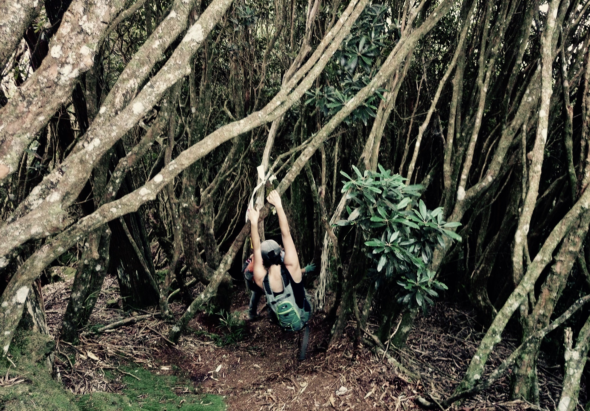

# Origin Story[^backdrop]

## Educational Decomposition

When young students first go to university there is excitement in the air. There's exhilaration in entering a world of open possibilities, where intellectual challenges await to stimulate minds and temper characters. But many are met with utter disappointment when faced with the reality that awaits them.

Politics aside, the educational system has become all about memorization, testing, and following orders. "Please answer this question from choices A, B, C, or D." Those with perfect memory are lauded and forgetfulness is a bane. There are correct answers and, horrifyingly, there seem to be correct questions too. Students are placed in artificial environments, physically and mentally, that do not reflect the real world or the kinds of challenges they will face as adults.

We are not robots. We were never meant to sit and rote memorize reams of pre-ordained "facts". We do not live in a world that was pre-mapped, we live in a world with unknowns. And we were meant to explore it.

## Open Jungles

It's hard to beat the feeling of repelling down a waterfall or sleeping on a mountaintop under the stars. There is a rush of excitement and a sense of fulfillment in these moments of exploration. What it must have been like to discover an entire new world untouched by human hand? How exciting it must have been to blaze new trails, to leave the first footprints on foreign land like the first brushstrokes on an empty canvas...To bushwhack -- in the original sense of the word.

This thirst is not an aberration, nor an undesirable attribute. Wandering provides opportunities for growth and improvement. So when one gets really lost, they may find their way back again. But these days it can be difficult to find opportunities to quench that sense of adventure. Even the moments mentioned above tend to happen within man-made boundaries of some kind: You might have to trespass to repel that waterfall and you'll need a permit to sleep on that mountaintop.

But the digital world may offer a partial substitute. Instead of forging new paths through tall grass, one can hop from tweet to tweet. Instead of collecting wood for campfire meals, collect blogs and quotes for mental chewing. Instead of leaving stone markers along the trail to find the way back, mark down weblinks to reconstruct a trail of thought.

## Walled Gardens

While venturing through the unknown, there is real risk to face. We may not be hunted big jungle cats, but equally dangerous things lurk in the digital wild. Everyone needs a place to rest, somewhere familiar and intelligible. It is each individual's responsibility to carve out a patch of understanding for themselves from what was once bewilderment and to cultivate that patch into a beautiful place of protected being: To tend one's garden in the jungle and to carry on the light through the dark of night.

So the other side of the adventure coin is responsibility. And while focusing on one's own domain might seem like a depressingly selfish notion, in reality this inclination serves a purpose: It's efficient. If every individual tends to their own patch, the lot of us collectively will transform a chaotic world into an ordered one.

Altogether, we make a decentralized network of sense-making. Altogether, our linked network of gardens may cumulatively tame the dangers in this vast jungle.

## Soul

These are the paths that led to the soul of this project: To learn in a manner we were meant to. To map the territory that we explore. And to tend one's own garden of the mind, while venturing through the jungle of digital collective consciousness.

  

> "...by their fruits you will know them."
> 
> ~ Matthew 7:16-27 NKJV

[^backdrop]: More of a 'backdrop' than a 'story'.
