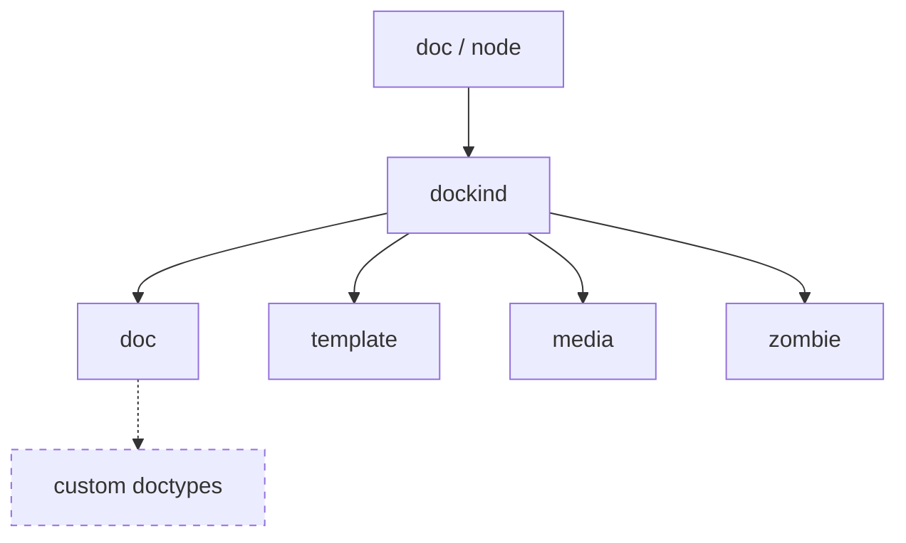
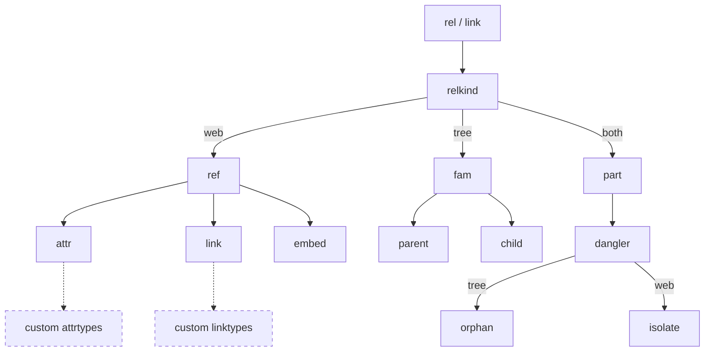
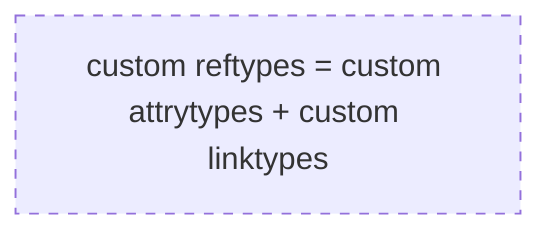

# Terminology

There is some terminology that will help in understanding technical decisions like variable name choice and should make clear seemingly implicit decisions with regard to WikiBonsai's innerworkings.

Most of this document is primarily meant for those that wish to develop software tooling in conjunction with the WikiBonsai project or those who wish to develop a deeper understanding of how the internals inform its workflows.

If you just want to take notes in markdown and don't want the nitty-gritty, head to [How To Use][wibomd-doc-use].

## Entities

Individual objects in the WikiBonsai framework -- generally corresponds to a single markdown file.

### File

`File` refers to the entity on disk and a "file type" refers to the kind of file it is (markdown file, image or .png file, etc.). "File metadata", which refers to os-level file metadata such as when a file was created, etc. These are distinct from [`docs`](#doc).

### Doc

`Doc` or `document` refers to the abstract entity that represents a (markdown) file and its "doctype" refers to document types defined by the user in WikiBonsai. A "doctype" can have corresponding "document metadata" which takes the form of caml or yaml attributes in the doc's markdown.

### Node

Refers to a node in a graph and a node corresponds to a [`doc`](#doc). A node will inherit its attributes, such as color, from the corresponding "doctype" (or underlying [`dockind`](#dockinds)).

## Relationships

See [relationship kinds](#relkinds).

## Structures

[Entities](#entities) and [relationships](#relationships) together build toward larger sense-making structures.

### Tree

The (semantic) `tree` or "knowledge bonsai" is the central ordering structure. It is not like a typical computer science tree [data structure][wiki-data-structure] in that it is not mainly for fast access like a [binary tree][wiki-binary-tree] or a [red black tree][wiki-red-black-tree] might. Rather, it is a hierarchical structure whose primary aim is to hold the shape of a tree as an aid for the user as they manually design, define, and refine.

The tree expects every nodes' name to be unique and that each name is a particular [word sense][wiki-word-sense].

### Web

The (semantic) `web`[^web3.0] or "concept web" is the central associative structure. It is built from node attributes which semantically describe their relationship.

## Type Hierarchy

Both [`kind`](#kind) and [`type`](#type) refer to portions of a type hierarchy where `kind` is the base level of a type hierarchy and `type` is a large subtree under one or some of those kinds.

For example, there are different `kinds` of wikirefs: "wikiattrs", "wikilinks", and "wikiembeds". But there are any number of `type`s as defined by the end-user. For example, if there is a wikiref that looks like this:

`:attribute::[[fname-a]]`

All of this text constitutes as a "wikiref". Since it has a type defined by the colons (`:attrtype::`), a reference defined by the square brackets (`[[fname-a]]`), and ends in a newline, it is a "wikiattr" **`kind`** of wikiref. Whereas the text between the colons (`:attrtype::`) is the `type` of the wikiref. So this wikiref's `kind` is "wikiattr" and `type` is "attrtype".

### Type

`Type`s are flexible and meant to be defined by the end-user in their markdown files.

### Kind

`Kind` is the first level of the overall type hierarchy. `Kind`s are bound to WikiBonsai functionality and inform how [`entities`](#entities) should be handled. Notable `kind`s are document kinds ([`dockinds`](#dockinds)) and relationship kinds ([`relkinds`](#relkinds)).

### DocKinds

`DocKind` stands for "kind of document". TIn WikiBonsai, [documents](#doc) are handled differently based on the [`kind`](#kind) that they are:

#### Doc

`Doc` is the generic kind which essentially tells the system "refer to user-defined doctypes". This basically acts as a root node for the doctype hierarchy as defined by the user. `doctypes` are largely interchangeable with `collections` in static site generators.

#### Media

`Media` refers to the kind of media the file is (markdown, audio, image, video) and is mainly used for wikiembeds to determine the appropriate embed method.

#### Template

`Template` refers to markdown documents that are skeletons used to populate new markdown files of the same type -- mostly by copying over desired attributes.

#### Zombie

A `zombie` is essentially an abstract document where there is no corresponding file. This allows for behaviors to be filled in where a document is expected, but one does not exist. For example, if `file-a.md` links to `[[file-b]]`, but `file-b.md` does not exist, then WikiBonsai will refer to a zombie document called `file-b` instead in places like the graph or in panels displaying forward or backward references.

### RelKinds

`RelKind` stands for "kind of relationship". In WikiBonsai, [relationships](#rel) are handled differently based on the [`kind`](#kind) that they are:

Granted it is a touch complex. But it is deliberately designed so that the [tree](#tree) and the [web](#web) structures can remain separate, yet co-exist. Each structure may be separately shaped by the user in isolation from one another.

#### Fam

`Fam` or "family relationships" are relationships that occur only in the [`tree`](#tree). `Parent` and `child` are listed here as they are the relationships directly attached to a node or document, but there are other tree relationships that may be calculated by traversing the tree too: `ancestors`, `parent`, `child`, `descendants`, and `lineage`.

#### Parent

A `parent` is a a [family](#fam) relationship is when an [entity](#entities) contains the current entity as a child in the [tree](#tree).

#### Child

A `child` is a [family](#fam) relationship is when the current [entity](#entities) contains other entities as a child the [tree](#tree).

#### Ref

References or `ref`s are [entity](#entities) connections in that make up the [web](#web), are synonymous with `wikiref`, and related types are called `reftype`s.

#### Attr

An `attr` is an "attribute" [reference](#ref) relationship in the [web](#web), is synonymous with `wikiattr`, and related types are called `attrtype`s.

It is a more formal kind of [reference](#ref) [relationship](#relkinds) that is used for `doctype` validation and queries. Attributes may also be thought of as intrinsic properties of a given [entity](#entities).

#### Link

A `link` is a [reference](#ref) relationship in the [web](#web), is synonymous with `wikilink`, and related types are called `linktype`s.

It is a less formal kind of [reference](#ref) meant for casual connections that might not necessarily be a formal [attribute](#attr) yet.

#### Embed

An `embed` is a [reference](#ref) relationship in the [web](#web), and is often synonymous with `wikiembed`.

It represents the instance where content is embedded in the linked location. It is also considered an informal relationship.

#### Part

`Part` stands for "partial relationship", where the connection composed of an entity, a relationship, and another entity is somehow broken. (The [`zombie`](#zombie) [`dockind`](#dockinds) might also be considered a partial relationship)

#### dangler

A `dangler` encapsulates both the [`orphan`](#orphan) and the [`isolate`](#isolate) -- so an [`entity`](#entities) that lacks relationships in either the [`web`](#web) or the [`tree`](#tree).

#### Orphan

An `orphan` is an [`entity`](#entities) that lacks any [relationship](#relkinds) in the [`tree`](#tree).

#### Isolate

A `isolate` is an [`entity`](#entities) that lacks any [relationship](#relkinds) in the [`web`](#web).

## Colors

Colors that show up in syntax highlights or in the graph tend to remain true to the digital gardening metaphor:

### Blue

...is used for attribute syntaxes (esp. colons `:`) and traditional hyperlinks. Attribute syntaxes might be thought of as water that flows between entities in the digital garden. And external hyperlinks might be thought of as links that point to the sky, toward the wider internet.

### Green

...is typically used for existing `[[wikirefs]]`, especially `entries`, which might be thought of as the leafy green foliage of one's digital garden.

### Grey

...is used for the (un)dead `[[zombie-wikirefs]]` that do not have a corresponding file or document.

### Yellow

...is typically used for `index` document `[[i.wikirefs]]`, which might be thought of as the trunk and branches of the knowledge bonsai in one's digital garden.

## Natural Metaphors ↔️ Technical Terms

| Metaphor            | Term            |
| ------------------- | --------------- |
| 🪴 digital garden   | vault           |
| 🎋 knowledge bonsai | semantic tree   |
| 🕸 web              | semantic web    |
| 🪵 trunk/branch     | index doctype   |
| 🍃 leaf             | entry doctype   |
| 🛏 (garden) bed     | starter project |
| 🌰 seed / germ      | sharable docs   |

[^web3.0]: Not to be confused with the [Web 3.0 semantic web][wiki-semantic-web] (although the two could possibly interopt in future).

[wiki-binary-tree]: <https://en.wikipedia.org/wiki/Binary_tree>
[wiki-data-structure]: <https://en.wikipedia.org/wiki/Data_structure>
[wiki-red-black-tree]: <https://en.wikipedia.org/wiki/Red%E2%80%93black_tree>
[wiki-semantic-web]: <https://en.wikipedia.org/wiki/Semantic_Web>
[wiki-word-sense]: <https://en.wikipedia.org/wiki/Word_sense>

[wibomd-doc-use]: <https://github.com/wikibonsai/wikibonsai/tree/main/docs/USE.md>
