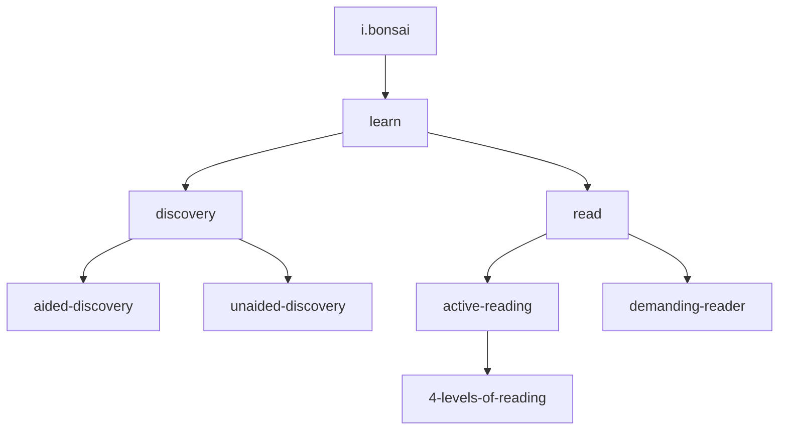
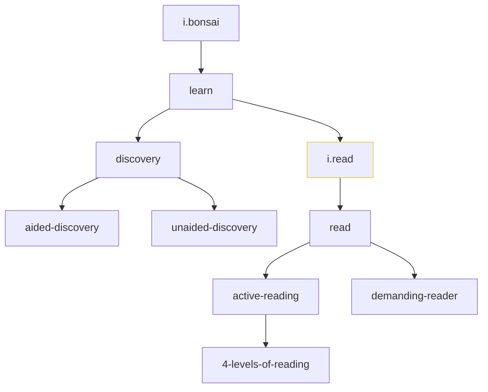

# How To Use

When first faced with personal knowledge management (PKM) as a topic, it is very common for people to ask, "How do I start?" "How should I organize it?" Below are some opinionated step-by-step tips for getting started.

This document describes, step-by-step, how to get up and running with a WikiBonsai flavoured digital garden. Some details are specific to WikiBonsai (e.g. configs and [`doctypes`](#doctypes)), but the rest of the workflow descriptions and overall structure could be adopted in other personal knowledge management applications or frameworks.

So, to get started:

1. Install the [wikbonsai VSCode extension][wibomd-repo-vscode-wikibonsai] or open up your PKM app of choice.
2. Clone the starter [garden bed][wibomd-repo-garden-beds].

Or...

- If you just want to see the end result, you can check out the [the bird's eye view](#a-birds-eye-view) and the ["How To Read A Book" garden bed][wibomd-repo-garden-beds--how-to-read-a-book].

As a sidenote, it is common in the PKM space to see people with two vaults, or separate collections of notes. One a touch chaotic and meant for tracking widely across all of one's work, while another is more ordered and finely curated. WikiBonsai aims for the latter vault-type where order, orientation, and sense-making are the primary goal, but is not limited to only that use.

## Placing Files: Directory Structure

The suggested WikiBonsai project structure is heavily influenced by [jekyll][jekyll]: Create a directory for each type of document you want to make (`doctype`; e.g. book, entry, essay, etc.) and place markdown files of that `doctype` into the target directory.

If you take a look at the [minimal starter bed][wibomd-repo-bed-starter], you might have a project structure something like this:

```bash
.
├── config.toml
├── t.doc.toml
│── entries/
├── index/
│   └── i.bonsai.md
└── templates/
    └── t.default.md
```

`config.toml` defines some basic configuration for your vault, such as which markdown file is the root of your bonsai and what attribute engine to use ([`caml`][wibomd-repo-caml-mkdn] or [`yaml`][yaml]).

`t.doc.toml` contains doctype information, such as which directory the documents live in or what emoji corresponds to that type.

`index`, `entries`, and `templates` are the directories which correspond to the doctypes `index`, `entry`, and `template` which are special doctypes with particular meaning in the WikiBonsai framework.

## Doctypes

Document types are used to determine what can be done with a document, like what metadata attributes can be expected, what directory those document are in, or what the markdown filename prefixes are. These attributes are defined in the doctype file whose default is `t.doc.toml`. `Doctype`s are mostly defined by you, but there are three kinds of types that are generally expected: `template`, `index`, `entry` doctypes.

Template documents are used to define what attributes can be expected for that particular doctype. New files will be populated with the same attributes listed in the corresponding template document of that doctype.

Index documents are used to build the semantic tree and can be thought of as the "trunk" of that tree. They should only contain metadata attributes and an unordered markdown list outline of `- [[wikilinks]]` that represents the shape of the tree. If an index document is linked, it will be traversed in full and appended to the tree. (This is useful in breaking the tree up over multiple files.) Any other documents that are linked will be included as "leaves", but will not traversed.

The main "leaves" are entry documents, which act like wikipedia entries. Each entry doc should map to a particular sense of a word (wikipedia-style [disambiguation][wiki-disam] is useful for making distinctions here) and contains descriptive information of the concept the word represents. For example, for the word "read" there might be one file called "read-(learn).md" to refer to humans reading to learn and another "read-(computer).md" to refer to computers reading data from disk. This separation allows us to distinguish between the different senses of the word "read".

## Cultivating A Semantic Tree

As for the process of actually filling in notes, let's walk through part of "[How To Read A Book][bk-how-to-read]":

Create a file for the book and call it `bk.how-to-read-a-book.md` (the `bk.` prefix means that it is a `book` doctype). Add a heading for the first chapter. Then add some of the vocab words from that chapter:

```markdown
// bk.how-to-read-a-book.md

: title :: How To Read A Book

## toc

## chapter 1

- [[active-reading]]
- [[aided-discovery]]
- [[unaided-discovery]]
- [[4-levels-of-reading]]

```

You could then create a separate entry document for each word[^zombie-node] -- you might even add a brief definition or tldr:

```markdown
// active-reading.md

: title :: active reading
: tldr  :: "an effortful activity of cooperation between reader/writer; to continually ask questions as you read and search for the corresponding answers."
```

As you continue reading, you might discover connections between ideas discussed within:

```markdown
// active-reading.md

// ...

- what a [[demanding-reader]] does.
```

Once you've read more of the book or gotten a feel for the subject-matter, you might integrate those concepts into your "semantic tree" or "knowledge bonsai", which takes the form of a markdown outline:

```markdown
// i.bonsai.md

: title :: knowledge bonsai
: tldr  :: "index of concepts."

- [[learn]]
  - [[discovery]]
    - [[aided-discovery]]
    - [[unaided-discovery]]
  - [[read]]
    - [[active-reading]]
      - [[4-levels-of-reading]]
    - [[demanding-reader]]
```

This outline represents a semantic tree that would look like this:



It is also possible to split the tree into multiple files:

```markdown
// i.bonsai.md

: title :: knowledge bonsai
: tldr  :: "index of concepts."

- [[learn]]
  - [[discovery]]
    - [[aided-discovery]]
    - [[unaided-discovery]]
  - [[i.read]]
```

```markdown
// i.read.md

: title :: reading index
: tldr  :: "index of concepts about reading."

- [[read]]
  - [[active-reading]]
    - [[4-levels-of-reading]]
  - [[demanding-reader]]
```

This builds a semantic tree mostly identical to the single-file one, with the extra index file `i.read` added:



By now, you might have a structure that looks something like this -- if you used a single file for the bonsai index:

```bash
.
├── config.toml
├── t.doc.toml
├── books
│   └── bk.how-to-read-a-book.md
│── entries
│   ├── 4-levels-of-reading.md
│   ├── active-reading.md
│   ├── aided-discovery.md
│   ├── demanding-reader.md
│   ├── discovery.md
│   ├── inspectional-reading.md
│   ├── learn.md
│   ├── read.md
│   └── unaided-discovery.md
├── index
│   └── i.bonsai.md
└── templates
    └── t.default.md
```

### In The Abstract

When building out the semantic tree, it's helpful to think of it as a hierarchical map of #tags. The tree outlines what you know and orders concepts into a quick and easy to traverse structure. Each tag name should be unique and map to a particular sense of a word -- like wikipedia pages.

## Mapping A Semantic Web

For those interested in leveraging WikiBonsai tooling to map semantic webs (in a [semantic space][how-chatgpt--meaning-space]), just be sure to pay attention to `:caml-attributes::[[and-wikiattrs]]`.

For example, let's look at the concept `active-reading` again:

```markdown
// active-reading.md

// ...

- what a [[demanding-reader]] does.
```

Right now, `demanding-reader` is a `wikilink`. These may just be a note-to-self, to review later, or something that bugs you. A `wikiattr`, on the other hand, is a formalized relationship between two documents. As we become more familiar with the material, or if we're just focusing on semantic webs, we might transform that off-the-cuff `[[wikilink]]` into a `:formal::[[wikiattr]]` to capture meaningful relationships:

```markdown
// active-reading.md

// ...

: attribute-of :: [[demanding-reader]]
```

To flesh out this concept's place in a semantic web, just add `:caml::[[wikiattrs]]` where appropriate. For example, we might add more attributes based on the `tldr`:

```markdown
// active-reading.md

: tldr         :: "an effortful activity of cooperation between reader/writer; to continually ask questions as you read and search for the corresponding answers."

// ...

: participants :: [[reader]], [[writer]]
: process      :: [[question]], [[answer]]
: requires     :: [[effort]]
: tag          :: [[read]]
```

Keep in mind that these new links would register as zombie links in our new vault because there is no corresponding markdown file. But WikiBonsai will still provide functionailty based on the existence of zombie links, such as showing the reference in forward and backward reference panels and so on.

Anyway, our `active-reading.md` file could look something like this at the end:

```markdown
// active-reading.md

: title        :: active reading
: attribute-of :: [[demanding-reader]]
: participants :: [[reader]], [[writer]]
: process      :: [[question]], [[answer]]
: requires     :: [[effort]]
: tag          :: [[read]]
: tldr         :: "an effortful activity of cooperation between reader/writer; to continually ask questions as you read and search for the corresponding answers."
```

Once you've added enough concepts, markdown files, and wikiattrs you can visualize the relationships in the (web) graph. To get a feel for the "semantic space", you would need to used fixed coordinates and ensure those coordinates pertain to some specific meaning coordinate system. (WikiBonsai does not currently provide meaningful coordinate systems...yet :))

### In The Abstract

If all has gone well, this process of note-making will feel like unrolling a map of the material you're reading, listening to, watching or experiencing. It will lay bare the concepts within and make available via [touchpoints][wibomd-doc-design--an-api-for-the-mind] which will make original sources easier to rediscover, make new connections to, and integrate with the rest of what you know. It should feel fairly intuitive.

## A Bird's Eye View

This is a concrete example of a process that generally includes these steps:

- **Capture**: When you come across a new word, add it as a `[[wikiref]]` -- perhaps in a file representing the source where you found it.
- **Verbalize**: Create a document for the concept and add a quick `def`inition or `tldr` for it -- consider writing a full essay about it.[^iyow]
- **Connect**: Add `[[wikirefs]]` to the new doc or to documents that point to it.
- **Integrate**: Find a place in your semantic tree that makes sense -- somewhere you can find it again later.

These steps do not need to be carried out in a single sitting or even in this particular order. It could take a week to get around to creating a document and half a year to start connecting it to other things you know.

As a sidenote, WikiBonsai has kept in mind legacy information organization techniques, which can be [referred to][wibomd-doc-design--legacy-techniques-of-organizing-information] as well.

## Appendix: In The Wild

The semantic tree is a very useful orienting structure once many concepts have been integrated into it. To see some larger examples for guidance, see the cited [site-navs][wibomd-doc-cite--sites].


[^iyow]: There are folks that say you should write everything "in your own words" and while this is an extraordinarily useful exercise, finding a good definition you want to integrate into your own knowledge is also good practice. That is what good ideas are for after all.
[^zombie-node]: It is not strictly necessary to create a document. Zombie nodes, wikirefs whose document does not yet exist, will be tracked as a single node in the system and can be created at any time.

[bk-how-to-read]: <https://www.goodreads.com/book/show/567610.How_to_Read_a_Book>
[how-chatgpt--meaning-space]: <https://writings.stephenwolfram.com/2023/02/what-is-chatgpt-doing-and-why-does-it-work/#meaning-space-and-semantic-laws-of-motion>
[jekyll]: <https://jekyllrb.com/docs/structure/>
[wiki-disam]: <https://en.wikipedia.org/wiki/Wikipedia:Disambiguation>
[yaml]: <https://yaml.org/>

[wibomd-doc-design]: <https://github.com/wikibonsai/wikibonsai/tree/main/docs/DESIGN.md>
[wibomd-doc-design--an-api-for-the-mind]: <https://github.com/wikibonsai/wikibonsai/tree/main/docs/DESIGN.md#an-api-for-the-mind>
[wibomd-doc-design--legacy-techniques-of-organizing-information]: <https://github.com/wikibonsai/wikibonsai/tree/main/docs/DESIGN.md#legacy-techniques-of-organizing-information>
[wibomd-doc-cite--sites]: <https://github.com/wikibonsai/wikibonsai/tree/main/docs/CITE.md#site-navs>

[wibomd-repo-bed-starter]: <https://github.com/wikibonsai/garden-beds/tree/main/minima>
[wibomd-repo-garden-beds]: <https://github.com/wikibonsai/garden-beds>
[wibomd-repo-caml-mkdn]: <https://github.com/wikibonsai/caml-mkdn>
[wibomd-repo-garden-beds--how-to-read-a-book]: <https://github.com/wikibonsai/garden-beds/tree/main/bk.how-to-read-a-book>
[wibomd-repo-vscode-wikibonsai]: <https://github.com/wikibonsai/vscode-wikibonsai>
