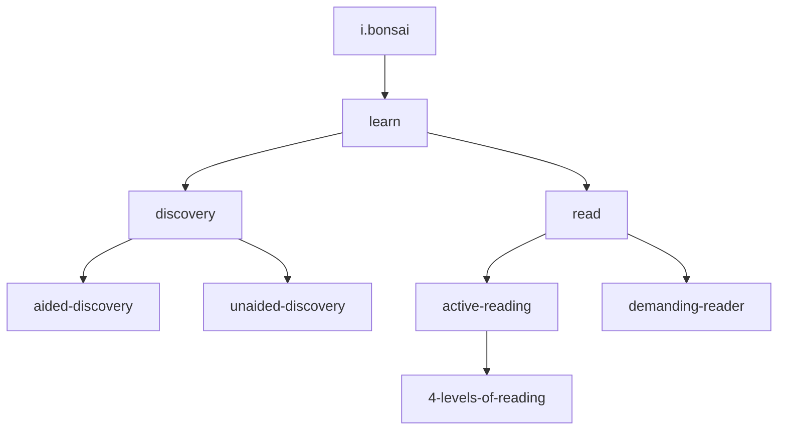
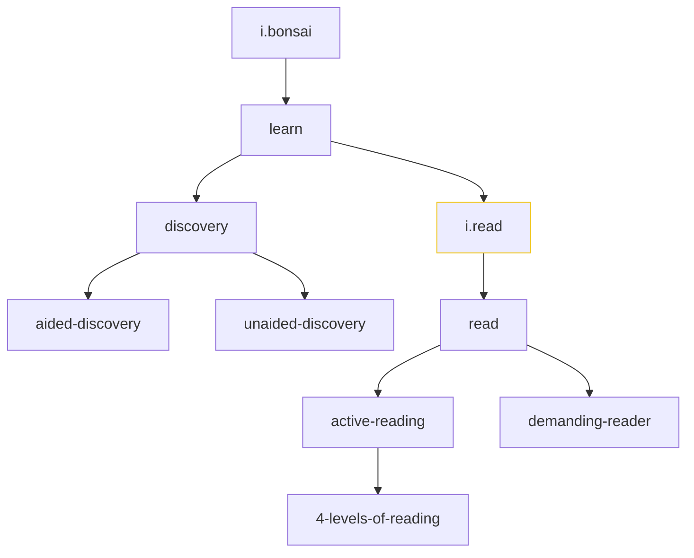

# How To Use

This document describes, step-by-step, how to get up and running with a WikiBonsai digital garden. Some details are specific to WikiBonsai (e.g. configs and [`doctypes`](#doctypes)), but the rest of the workflow descriptions and overall structure could be adopted in other knowledge management applications or frameworks -- whether tended by a person, an AI agent, or both.

So, to get started:

1. Pick your tool: the [VSCode extension][wibomd-repo-vscode-tendr], the [CLI][wibomd-repo-tendr-cli], or the [agent skill][wibomd-repo-tendr-skill].
2. Clone a starter [garden bed][wibomd-repo-transplant-starters].

Or...

- If you just want to see the end result, you can check out [the bird's eye view](#a-birds-eye-view) and the ["How To Read A Book" garden bed][wibomd-repo-transplant-starters--how-to-read-a-book].

## Directory Structure

The suggested WikiBonsai project structure is heavily influenced by [jekyll][jekyll]: Create a directory for each type of document you want to make (`doctype`; e.g. book, entry, essay, etc.) and place markdown files of that `doctype` into the target directory.

If you take a look at the [minimal starter bed][wibomd-repo-bed-starter], you might have a project structure something like this:

```bash
.
├── config.toml
├── t.doc.toml
│── entries/
├── index/
│   └── i.bonsai.md
└── templates/
    └── t.default.md
```

`config.toml` defines some basic configuration for your garden, such as which markdown file is the root of your bonsai and what attribute engine to use ([`caml`][wibomd-repo-caml-mkdn] or [`yaml`][yaml]).

`t.doc.toml` contains [doctype](#doctypes) information, such as which directory the documents live in or what icon corresponds to that type.

`index`, `entries`, and `templates` are the directories which correspond to those [doctypes](#doctypes).

## Doctypes

Organizing files by type makes it easy to know what kind of content you're looking at and what you can do with it -- whether you're browsing your own notes or an agent is traversing the garden programmatically.

Document types determine what can be done with a markdown file, like what metadata attributes can be expected, what directory those documents are in, or what the filename prefixes are. These attributes are defined in the doctype file whose default is `t.doc.toml`. Doctypes are mostly defined by you, but there are three kinds of types that are generally expected: `index`, `entry`, and `template` doctypes.

`Index` documents are used to build the [semantic tree][wibomd-repo-semtree] and can be thought of as the "trunk" of that tree. They typically contain metadata attributes and a markdown list outline of `- [[wikilinks]]` that represents the shape of the tree. If an index document is linked, it will be traversed in full and appended to the tree. (This is useful in breaking the tree up over multiple files.) Any other documents that are linked will be included as "leaves", but will not be traversed.

```markdown
// i.bonsai.md

: title :: knowledge bonsai
: tldr  :: "index of concepts."

- [[learn]]
  - [[discovery]]
  - [[read]]
```

The main "leaves" are `entry` documents, which act like wikipedia entries. Each entry doc should map to a particular sense of a word (wikipedia-style [disambiguation][wiki-disam] is useful for making distinctions here) and contains descriptive information of the concept the word represents. For example, for the word "read" there might be one file called "read-(learn).md" to refer to humans reading to learn and another "read-(computer).md" to refer to computers reading data from disk. This separation allows us to distinguish between the different senses of the word "read".

```markdown
// active-reading.md

: title :: active reading
: tldr  :: "an effortful activity of cooperation between reader/writer."

- what a [[demanding-reader]] does.
```

Template documents are used to define what attributes can be expected for that particular doctype. New files will be populated with the same attributes listed in the corresponding template document of that doctype.

```markdown
// t.book.md

: title  :: 
: author ::
: pdate  ::
```

## Cultivating A Semantic Tree

A flat collection of notes is hard to navigate once it grows beyond a handful of files. A semantic tree gives your concepts a place in a hierarchy -- like a table of contents for everything you know. It makes large gardens navigable and gives both people and agents a structured way to find and relate concepts.

Let's walk through how you might build one as you're reading a book. Say we're reading "[How To Read A Book][bk-how-to-read]": Create a file for the book and call it `bk.how-to-read-a-book.md` (the `bk.` prefix means that it is a `book` doctype). Add a heading for the first chapter. Then add some of the vocab words from that chapter:

```markdown
// bk.how-to-read-a-book.md

: title :: How To Read A Book

## toc

## chapter 1

- [[active-reading]]
- [[aided-discovery]]
- [[unaided-discovery]]
- [[4-levels-of-reading]]

```

You could then create a separate entry document for each word[^zombie-node] -- you might even add a brief definition or tldr:

```markdown
// active-reading.md

: title :: active reading
: tldr  :: "an effortful activity of cooperation between reader/writer; to continually ask questions as you read and search for the corresponding answers."
```

As you continue reading, you might discover connections between ideas discussed within:

```markdown
// active-reading.md

// ...

- what a [[demanding-reader]] does.
```

Once you've read more of the book or gotten a feel for the subject-matter, you might integrate those concepts into your "semantic tree" or "knowledge bonsai", which takes the form of a markdown outline:

```markdown
// i.bonsai.md

: title :: knowledge bonsai
: tldr  :: "index of concepts."

- [[learn]]
  - [[discovery]]
    - [[aided-discovery]]
    - [[unaided-discovery]]
  - [[read]]
    - [[active-reading]]
      - [[4-levels-of-reading]]
    - [[demanding-reader]]
```

This outline represents a semantic tree that would look like this:


```mermaid
graph TD;
  id1[i.bonsai]       --> id2[learn];

  id2[learn]          --> id3[discovery];
  id2[learn]          --> id4[read];

  id3[discovery]      --> id5[aided-discovery];
  id3[discovery]      --> id6[unaided-discovery];
  id4[read]           --> id7[active-reading];
  id4[read]           --> id8[demanding-reader];

  id7[active-reading] --> id9[4-levels-of-reading];
```

It is also possible to split the tree into multiple files:

```markdown
// i.bonsai.md

: title :: knowledge bonsai
: tldr  :: "index of concepts."

- [[learn]]
  - [[discovery]]
    - [[aided-discovery]]
    - [[unaided-discovery]]
  - [[i.read]]
```

```markdown
// i.read.md

: title :: reading index
: tldr  :: "index of concepts about reading."

- [[read]]
  - [[active-reading]]
    - [[4-levels-of-reading]]
  - [[demanding-reader]]
```

This builds a semantic tree mostly identical to the single-file one, with the extra index file `i.read` added:


```mermaid
graph TD;
  id1[i.bonsai]       --> id2[learn];

  id2[learn]          --> id3[discovery];
  id2[learn]          --> id4[i.read];

  id3[discovery]      --> id5[aided-discovery];
  id3[discovery]      --> id6[unaided-discovery];
  id4[i.read]         --> id7[read];

  id7[read]           --> id8[active-reading];
  id7[read]           --> id9[demanding-reader];

  id8[active-reading] --> id10[4-levels-of-reading];

  style id4 stroke:#F0C61F;
```

By now, you might have a structure that looks something like this -- if you used a single file for the bonsai index:

```bash
.
├── config.toml
├── t.doc.toml
├── books
│   └── bk.how-to-read-a-book.md
│── entries
│   ├── 4-levels-of-reading.md
│   ├── active-reading.md
│   ├── aided-discovery.md
│   ├── demanding-reader.md
│   ├── discovery.md
│   ├── inspectional-reading.md
│   ├── learn.md
│   ├── read.md
│   └── unaided-discovery.md
├── index
│   └── i.bonsai.md
└── templates
    └── t.default.md
```

### In The Abstract

When building out the semantic tree, it's helpful to think of it as a hierarchical map of #tags. The tree outlines what you know and orders concepts into a quick and easy to traverse structure. Each tag name should be unique and map to a particular sense of a word -- like wikipedia pages.

## Mapping A Semantic Web

A semantic tree tells you *where* a concept sits in a hierarchy. But concepts also have relationships that cut across the tree -- "active reading" isn't just a child of "read," it's also an attribute of "demanding reader" and involves "effort." Capturing these cross-cutting relationships turns your tree into a richer semantic web (in a [semantic space][how-chatgpt--meaning-space]).

To map these relationships, pay attention to `:caml-attributes::[[and-wikiattrs]]`.

For example, let's look at the concept `active-reading` again:

```markdown
// active-reading.md

// ...

- what a [[demanding-reader]] does.
```

Right now, `demanding-reader` is a `wikilink`. These may just be a note-to-self, to review later, or something that bugs you. A `wikiattr`, on the other hand, is a formalized relationship between two documents. As we become more familiar with the material, or if we're just focusing on semantic webs, we might transform that off-the-cuff `[[wikilink]]` into a `:formal::[[wikiattr]]` to capture meaningful relationships:

```markdown
// active-reading.md

// ...

: attribute-of :: [[demanding-reader]]
```

To flesh out this concept's place in a semantic web, just add `:caml::[[wikiattrs]]` where appropriate. For example, we might add more attributes based on the `tldr`:

```markdown
// active-reading.md

: tldr         :: "an effortful activity of cooperation between reader/writer; to continually ask questions as you read and search for the corresponding answers."

// ...

: participants :: [[reader]], [[writer]]
: process      :: [[question]], [[answer]]
: requires     :: [[effort]]
: tag          :: [[read]]
```

Keep in mind that these new links would register as zombie links in our new garden because there is no corresponding markdown file. But WikiBonsai will still provide functionality based on the existence of zombie links, such as showing the reference in forward and backward reference panels and so on.

Putting it all together, our `active-reading.md` file could look something like this:

```markdown
// active-reading.md

: title        :: active reading
: attribute-of :: [[demanding-reader]]
: participants :: [[reader]], [[writer]]
: process      :: [[question]], [[answer]]
: requires     :: [[effort]]
: tag          :: [[read]]
: tldr         :: "an effortful activity of cooperation between reader/writer; to continually ask questions as you read and search for the corresponding answers."
```

Once you've added enough concepts, markdown files, and wikiattrs you can visualize the relationships in the (web) graph. To get a feel for the "semantic space", you would need to use fixed coordinates and ensure those coordinates pertain to some specific meaning coordinate system. (WikiBonsai does not currently provide meaningful coordinate systems...yet :))

### In The Abstract

If all has gone well, this process of note-making will feel like unrolling a map of the material you're reading, listening to, watching or experiencing. It will lay bare the concepts within and make them available via [touchpoints][wibomd-doc-design--an-api-for-the-mind] which will make original sources easier to rediscover, make new connections to, and integrate with the rest of what you know. It should feel fairly intuitive.

## A Bird's Eye View

This is a concrete example of a process that generally includes these steps:

- **Capture**: When you come across a new word, add it as a `[[wikiref]]` -- perhaps in a file representing the source where you found it.
- **Verbalize**: Create a document for the concept and add a quick `def`inition or `tldr` for it -- consider writing a full essay about it.[^iyow]
- **Connect**: Add `[[wikirefs]]` to the new doc or to documents that point to it.
- **Integrate**: Find a place in your semantic tree that makes sense -- somewhere you can find it again later.

These steps do not need to be carried out in a single sitting or even in this particular order. It could take a week to get around to creating a document and half a year to start connecting it to other things you know.

As a sidenote, WikiBonsai has kept in mind legacy information organization techniques, which can be [referred to][wibomd-doc-design--legacy-techniques-of-organizing-information] as well.

## Appendix: In The Wild

The semantic tree is a very useful orienting structure once many concepts have been integrated into it. To see some larger examples for guidance, see the cited [site-navs][wibomd-doc-cite--sites].

## Usage Note

The systems you interact with have an effect on the way you think. This system is meant to provide a ["jungle gym for thought,"][wibomd-doc-philosophy--a-jungle-gym-for-thought] but it can't do everything and might even have negative consequences if used improperly. Here are some supplemental suggestions for adopting a knowledge framework such as this, especially for educational purposes:

### Write Full Essays

The workflows this project enables are meant to help develop an explicit relationship with the words you use. It's possible over-reliance on a tool like this (like many other digital productivity tools) can allow, or even facilitate, overly modular and fractured trains of thought. Writing [full essays][utb-essay] can combat fractured thinking and exercise those parts of the mind.

### Refer to Common Cultural Reference Points
###### (such as [britannica][britannica] or [wikipedia][wikipedia])

By adopting a tool specifically meant for mapping vocabulary, it can be tempting to use niche words or make up one's own to demarcate an idea. But too much of this risks building a Tower of Babel and losing the ability to communicate effectively with others. Use shared vocabulary where you can and if you've found a word of better fit, use it with others. That is the purpose of language after all.

### There is Never a "Final Word"

Like this project it is best to view a set of notes and explicit knowledge as a current state of affairs -- it's the state of the trail; of how much clutter has been cleared away. The goal is to build a navigable path for yourself, but to remain aware of what other things lie beyond the already-explored path. Always be open to what hard reality is telling you, especially while getting your hands dirty.

### Get Your Hands Dirty

The digital world cannot replace practical, hands-in-the-mud experience. No matter what you learn or study be sure to learn something, _anything_, that requires your hands in the real world.


[^iyow]: There are folks that say you should write everything "in your own words" and while this is an extraordinarily useful exercise, finding a good definition you want to integrate into your own knowledge is also good practice. That is what good ideas are for after all.
[^zombie-node]: It is not strictly necessary to create a document. Zombie nodes, wikirefs whose document does not yet exist, will be tracked as a single node in the system and can be created at any time.

[britannica]: <https://britannica.com/>
[bk-how-to-read]: <https://www.goodreads.com/book/show/567610.How_to_Read_a_Book>
[how-chatgpt--meaning-space]: <https://writings.stephenwolfram.com/2023/02/what-is-chatgpt-doing-and-why-does-it-work/#meaning-space-and-semantic-laws-of-motion>
[jekyll]: <https://jekyllrb.com/docs/structure/>
[wiki-disam]: <https://en.wikipedia.org/wiki/Wikipedia:Disambiguation>
[utb-essay]: <https://www.youtube.com/watch?v=XHIhtWPpDVI>
[wikipedia]: <https://www.wikipedia.org>
[yaml]: <https://yaml.org/>

[wibomd-doc-philosophy--a-jungle-gym-for-thought]: <https://github.com/wikibonsai/wikibonsai/tree/main/docs/PHILOSOPHY.md#a-jungle-gym-for-thought>
[wibomd-doc-design]: <https://github.com/wikibonsai/wikibonsai/tree/main/docs/DESIGN.md>
[wibomd-doc-design--an-api-for-the-mind]: <https://github.com/wikibonsai/wikibonsai/tree/main/docs/DESIGN.md#an-api-for-the-mind>
[wibomd-doc-design--legacy-techniques-of-organizing-information]: <https://github.com/wikibonsai/wikibonsai/tree/main/docs/DESIGN.md#legacy-techniques-of-organizing-information>
[wibomd-doc-cite--sites]: <https://github.com/wikibonsai/wikibonsai/tree/main/docs/CITE.md#site-navs>

[wibomd-repo-bed-starter]: <https://github.com/wikibonsai/transplant-starters/tree/main/minima>
[wibomd-repo-transplant-starters]: <https://github.com/wikibonsai/transplant-starters>
[wibomd-repo-caml-mkdn]: <https://github.com/wikibonsai/caml-mkdn>
[wibomd-repo-transplant-starters--how-to-read-a-book]: <https://github.com/wikibonsai/transplant-starters/tree/main/bk.how-to-read-a-book>
[wibomd-repo-tendr-cli]: <https://github.com/wikibonsai/tendr-cli>
[wibomd-repo-tendr-skill]: <https://github.com/wikibonsai/tendr-skill>
[wibomd-repo-semtree]: <https://github.com/wikibonsai/semtree>
[wibomd-repo-vscode-tendr]: <https://github.com/wikibonsai/vscode-tendr>
